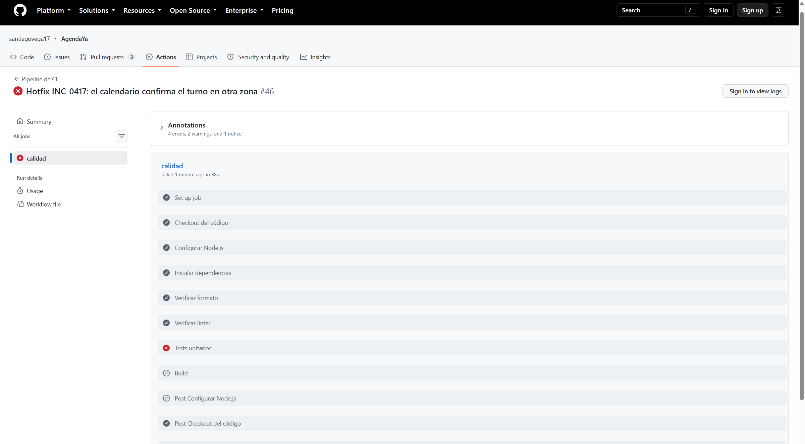
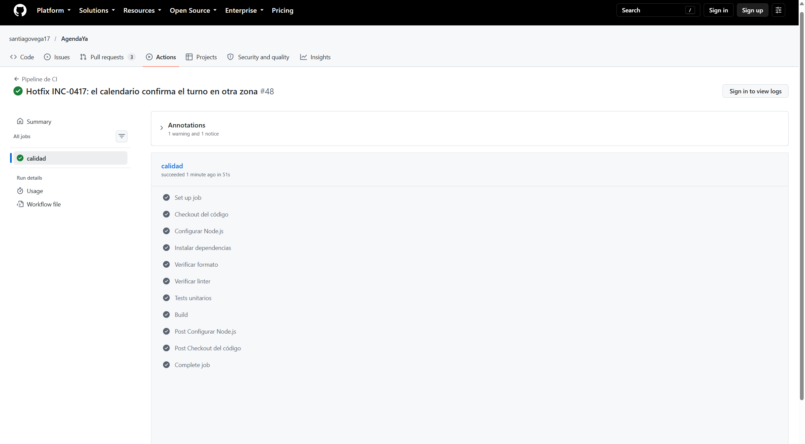

# TP N.º 7 — Plan de desarrollo y mantenimiento

Universidad Tecnológica Nacional — Facultad Regional Mendoza  
Ingeniería y Calidad de Software — 4K9

**Grupo 6 — AgendaYA**  
Módulos: M02 Gestión de disponibilidad y M04 Booking público

Integrantes: Moyano, Bruno Ezequiel (50229); Rosales Pedroza, Nicolás Adrián (50564); Vega Gallardo, Santiago Nicolás (50194); Nuñez, Francisco (50110); Zalazar, Valentin (50491); Serralta, Julian (47786).

Repositorio: https://github.com/santiagovega17/AgendaYa

---

## 1. Incidente

**INC-0417 · Severidad: crítica · Módulo: M04 Booking público**

Desde el último despliegue, invitados que reservan desde el celular y están en un huso distinto al del administrador reciben la confirmación con el horario desplazado una hora. SLA de resolución: 4 horas. Reportado por Soporte N1.

### El defecto ya estaba en el código

No hizo falta inyectarlo. La pantalla de confirmación muestra `horaInicio` y `horaFin` como texto (`10:00 a 10:30 h`) y ahí la hora es la correcta. El defecto está en el archivo que el invitado descarga con **Agregar a mi calendario**.

`downloadIcs` armaba el evento con hora flotante, sin zona:

```text
DTSTART:20261019T100000
DTEND:20261019T103000
```

Un calendario de celular interpreta esa hora en la zona del teléfono, no en la del administrador. Buenos Aires es UTC−3 y La Paz es UTC−4. Para un turno de las 10:00 en Buenos Aires el celular de La Paz mostraba las 10:00 locales, una hora más tarde que el instante real (que en La Paz son las 09:00).

### El cambio que lo corrige

`src/lib/ics.ts` convierte la hora de pared a UTC con la zona del administrador (`fromZonedTime` de `date-fns-tz`) antes de escribir el `.ics`. Las 10:00 de `America/Argentina/Buenos_Aires` quedan `DTSTART:20261019T130000Z`. `ConfirmationStep` le pasa `profile.timezone`.

El test nuevo es `src/lib/ics.test.ts`. Sobre el código anterior falla: espera `DTSTART:20261019T130000Z` y el archivo decía `DTSTART:20261019T100000`. Con el arreglo, los tres casos pasan.

---

## 2. Plan de desarrollo y mantenimiento del hotfix

El hotfix es un correctivo urgente sobre lo que está en producción. No entra en el ciclo planificado de versiones. Igual recorre revisión, tests automáticos y una rama protegida. El SLA de 4 horas no saltea esos controles: los acota.

### 2.1 Gestión del cambio

Soporte N1 registra el incidente con el identificador, el módulo, el síntoma, la hora de detección y el SLA. No propone la causa.

Lo clasifica el integrante de guardia del módulo M04. Es un hotfix, y no un cambio ordinario, solo si se cumplen las cuatro condiciones: está en producción, la severidad es crítica, hay un SLA de horas y el alcance se puede limitar a la causa del síntoma. Un pedido de mejora o un defecto sin usuarios afectados sigue el ciclo normal, por `develop`.

Autoriza el arreglo un integrante que no lo escribió. La autorización queda en la aprobación del pull request. Sin esa aprobación no se integra a `main`.

### 2.2 Estrategia de ramas

Usamos GitFlow en corto, porque el repositorio hoy integra por `main` y el plan necesita una rama de integración que no sea producción.

| Rama                                | Rol                                                                               |
| ----------------------------------- | --------------------------------------------------------------------------------- |
| `main`                              | Producción. De acá nace el hotfix y acá vuelve.                                   |
| `develop`                           | Integración de la próxima versión. Recibe el mismo arreglo para que no se pierda. |
| `hotfix/inc-0417-confirmacion-zona` | El correctivo. Sale de `main` actualizado.                                        |

El flujo es: actualizar `main`, crear `hotfix/inc-0417-confirmacion-zona`, commitear el test que reproduce el defecto y después el arreglo, abrir un pull request hacia `main`. Cuando ese PR se fusiona, se abre otro desde la misma rama hacia `develop` (o se fusiona `main` en `develop`). Si el fix solo entra a `main`, la próxima versión que salga de `develop` lo pisa.

El pipeline corre en los pull requests hacia `main` y hacia `develop`, y en cada push a `hotfix/**`.

### 2.3 Proceso de revisión

Todo pull request de hotfix necesita una aprobación de un integrante que no haya escrito el fix. No se aprueba el propio PR.

La revisión mira cuatro cosas: que el diff se limite al incidente, que exista el test que fallaba antes del arreglo, que el pipeline esté en verde y que el plan de reversión esté escrito en la descripción del PR.

Si en 30 minutos no hay revisor, se escala a cualquier otro integrante del equipo. Si tampoco responde y el SLA está por vencer, un segundo integrante puede aprobar dejando en el PR la hora del escalamiento y a quién se llamó. No se fusiona con el pipeline en rojo.

### 2.4 Aseguramiento de la calidad

Automatizado, en el pipeline, en este orden: formato (Prettier), linter (ESLint), tests unitarios (Vitest, incluidos los de `src/lib/ics.test.ts`) y build de Next.js. Esos cuatro pasos son independientes. Si el formato falla, no se llega a decir que los tests pasaron.

El test del incidente es la prueba de que el defecto no vuelve. El resto de la suite unitaria (límite diario, bloqueo de días, horarios vencidos, datos del invitado) es la regresión automática.

Manual, antes de fusionar: quien revisa descarga el `.ics` de un turno a las 10:00 de un administrador en Buenos Aires y lo abre en un perfil de calendario con zona `America/La_Paz`. Tiene que caer a las 09:00 de La Paz, el mismo instante. La pantalla de confirmación de la reserva sigue mostrando `10:00 a 10:30 h`.

Los E2E de Cypress del TP6 no entran en este pipeline. La justificación está en la sección 3.

### 2.5 Ambientes

| Ambiente                                   | Qué se valida                                                                                                                  |
| ------------------------------------------ | ------------------------------------------------------------------------------------------------------------------------------ |
| Desarrollo, en la máquina de quien corrige | El test nuevo en rojo contra el código viejo y en verde con el arreglo. `npm test`.                                            |
| Control del pipeline (GitHub Actions)      | Formato, linter, suite unitaria completa y build. Es la puerta de `main` y de `develop`. No hay un servidor de staging aparte. |
| Producción (`main`)                        | Después del merge. Soporte confirma con un caso real o con el calendario en la otra zona que el horario ya no se corre.        |

No desplegamos a un hosting intermedio. El grupo no tiene Firebase ni otro ambiente publicado. Inventar un deploy automático sin proyecto de hosting dejaría el pipeline en rojo.

### 2.6 Despliegue y aprobación

El despliegue a producción es el merge a `main`. No es automático hacia un hosting: no hay ambiente de Firebase configurado. El merge sí exige la aprobación del revisor y el pipeline en verde. Esa aprobación queda registrada en el pull request de GitHub (autor, revisor, hora y resultado de los checks).

Quien fusiona es el revisor, no el autor del fix.

### 2.7 Plan de reversión

Si en producción el calendario sigue mal o el arreglo rompe otra reserva, se revierte el merge de `main` con `git revert` del commit de merge y se abre un PR de revert hacia `main`. El pipeline vuelve a correr. No se fuerza el historial y no se redeploya a mano un build viejo sin pasar por el mismo PR.

El revert es chico (la generación del `.ics` y su test). Tiempo esperado desde que se decide volver atrás hasta que `main` queda en el estado anterior: menos de 30 minutos, dentro del mismo SLA si el problema aparece enseguida. `develop` recibe el mismo revert para no reintroducir el cambio.

### 2.8 Comunicación y cierre

| Momento                 | A quién             | Qué                                                                                   |
| ----------------------- | ------------------- | ------------------------------------------------------------------------------------- |
| Al abrir el hotfix      | El equipo, en el PR | Síntoma, causa y el test que la reproduce.                                            |
| Al fusionar a `main`    | Soporte N1          | El incidente está corregido en producción y cómo verificarlo.                         |
| Al fusionar a `develop` | El equipo           | El arreglo ya no se pierde en la próxima versión.                                     |
| Al cerrar               | Soporte N1          | Hora de cierre, causa y enlace al PR. El incidente queda documentado en este informe. |

---

## 3. Pipeline

Archivo: `.github/workflows/main.yml`. Un solo job, `calidad`, con un paso por cada verificación.

Se dispara en pull requests hacia `main`, `develop` y `hotfix/**`, y en cada push a esas ramas. Node 22, porque Cypress 16 y `@supabase/supabase-js` 2.117 piden el `WebSocket` nativo y Node 20 no lo tiene.

### Nivel obligatorio

| Requisito                                               | Cómo se cumple                                                       |
| ------------------------------------------------------- | -------------------------------------------------------------------- |
| Tests unitarios                                         | Paso `Tests unitarios` (`npm test`).                                 |
| Linter                                                  | Paso `Verificar linter` (`npm run lint`).                            |
| Formato                                                 | Paso `Verificar formato` (`npm run format:check`, Prettier).         |
| Build                                                   | Paso `Build` (`npm run build`).                                      |
| Test que reproduce el defecto                           | `src/lib/ics.test.ts`. Falla si el `.ics` vuelve a la hora flotante. |
| Corre en PRs a `develop`, `main` y las ramas del hotfix | `pull_request` y `push` sobre `main`, `develop` y `hotfix/**`.       |

### Nivel deseable

**Protección de ramas.** Hay que activarla en GitHub, en el repositorio público, sobre `main` y `develop`:

- No se fusiona con el check `calidad` en rojo o pendiente.
- Exige una aprobación.
- El autor del PR no puede ser el único que aprueba.
- No se puede hacer push directo a `main` ni a `develop`.

Eso no se puede dejar en un archivo del repositorio: es una regla del remoto. Hasta que el equipo la active en Settings → Branches, el plan y el código ya la exigen, pero GitHub todavía no la bloquea.

**Tests E2E de Cypress.** No se ejecutan en el pipeline. Cada caso entra a Supabase con el administrador de test, borra y vuelve a cargar su agenda, y necesita la app en `http://localhost:3000` más `E2E_ADMIN_EMAIL` y `E2E_ADMIN_PASSWORD`. Correrlos en cada PR alarga el SLA del hotfix y acopla el correctivo a un servicio externo. Se siguen corriendo en local con `npm run cy:run` antes de una demo o de un cambio de interfaz. El incidente INC-0417 queda cubierto por el test unitario, que no necesita navegador ni base de datos.

### Nivel avanzado

No se aborda. No hay proyecto de Firebase Hosting ni secretos de deploy. Un paso de despliegue sin esas credenciales fallaría siempre y bloquearía el hotfix. El despliegue a producción queda como el merge a `main`, con la aprobación descripta en la sección 2.6.

### Evidencia

En esta máquina, con Node v22.23.3, `npm test` corre 8 archivos y 55 tests. Con el arreglo, los 3 de `src/lib/ics.test.ts` pasan. Contra la hora flotante, fallan.

El pull request es el [#18](https://github.com/santiagovega17/AgendaYa/pull/18), rama `hotfix/inc-0417-confirmacion-zona`.

La corrida en rojo es la [#46](https://github.com/santiagovega17/AgendaYa/actions/runs/37836737496), commit `f7f5d81`: el test nuevo ya estaba y el calendario seguía en hora flotante. Formato y linter pasaron. Los tests unitarios fallaron. El build no llegó a ejecutarse.



La corrida en verde es la [#48](https://github.com/santiagovega17/AgendaYa/actions/runs/37836983550), commit `e1c7ec3`: el `.ics` queda anclado a UTC. Formato, linter, tests unitarios y build pasaron.



---

## 4. Lecciones aprendidas

**Qué funcionó.** Tener los tests del TP6 ya escritos hizo evidente qué no puede entrar al pipeline de un hotfix. El test del `.ics` es chico, no abre el navegador y alcanza para trabar la regresión.

**Qué falló.** Node 20, el que venía instalado en el sistema, no corre Cypress ni el cliente nuevo de Supabase: falta el `WebSocket` nativo. El perfil de fnm que activaba Node 22 no cargaba porque PowerShell rechazaba los scripts. En `cypress open`, con Chrome, un `cy.reload()` contra el servidor de desarrollo de Next a veces no termina.

**Herramientas.** fnm para usar Node 22 sin tocar la instalación del sistema. Vitest para el defecto. Prettier y ESLint como pasos separados del pipeline, no como un solo `npm test`. GitHub Actions para que el PR no dependa de que alguien se acuerde de correr los comandos.

**Riesgos.** Los E2E comparten una sola agenda de Supabase. Dos corridas al mismo tiempo se pisan los datos y un caso que estaba bien falla. El SLA de 4 horas empuja a saltear la revisión: el plan deja escrito el escalamiento a los 30 minutos en lugar de permitir un push directo.

**Defectos técnicos y cómo se resolvieron.** La confirmación de calendario no tenía zona horaria. Se ancla el instante a UTC con la zona del administrador y se cubre con `src/lib/ics.test.ts`. El clic de Cypress sobre Guardar quedaba debajo de la barra fija de Disponibilidad en Chrome; el test de límite diario ahora centra el botón antes de pulsarlo, y la recarga se reemplazó por una visita a la misma ruta.
